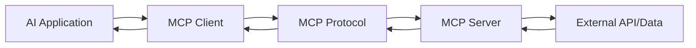

# Perplexity MCP Server 完整实作教学

## 目录
1. [MCP 协议简介](#1-mcp-协议简介)
2. [Perplexity Sonar API 介绍](#2-perplexity-sonar-api-介绍)
3. [环境准备与依赖安装](#3-环境准备与依赖安装)
4. [MCP Server 架构设计](#4-mcp-server-架构设计)
5. [核心实现代码](#5-核心实现代码)
6. [与Claude集成](#6-与claude集成)
7. [测试与调试](#7-测试与调试)
8. [进阶功能扩展](#8-进阶功能扩展)
9. [常见问题解决](#9-常见问题解决)

---

## 1. MCP 协议简介

### 1.1 什么是 MCP？
Model Context Protocol (MCP) 是一个开放标准，旨在连接 AI 助手与数据系统。它提供了一个通用接口，让 AI 应用能够访问结构化和非结构化数据，无需自定义集成。

### 1.2 MCP 的核心概念
- **Server**: 提供数据和工具的服务端
- **Client**: 使用 Server 提供功能的客户端（如 Claude）
- **Transport**: 通信层（stdio, HTTP 等）
- **Resources**: Server 提供的数据资源
- **Tools**: Server 提供的可执行功能

### 1.3 MCP 工作流程


---

## 2. Perplexity Sonar API 介绍

### 2.1 Sonar API 特性
- **实时搜索**: 提供最新的网络信息
- **智能摘要**: 自动综合多个来源的信息
- **引用来源**: 提供可验证的信息来源
- **多模型支持**: 支持不同的 AI 模型配置

### 2.2 API 端点
```
https://api.perplexity.ai/chat/completions
```

### 2.3 支持的模型
- `sonar-small-chat`: 快速响应，适合简单查询
- `sonar-medium-chat`: 平衡性能和质量
- `sonar-large-chat`: 高质量响应，适合复杂查询

---

## 3. 环境准备与依赖安装

### 3.1 系统要求
- Node.js 18.0 或更高版本
- npm 或 yarn 包管理器
- Perplexity API Key

### 3.2 创建项目结构
```bash
mkdir perplexity-mcp-server
cd perplexity-mcp-server
npm init -y
```

### 3.3 安装依赖
```bash
npm install @modelcontextprotocol/sdk
npm install axios dotenv
npm install --save-dev typescript @types/node
npm install --save-dev tsx nodemon
```

### 3.4 配置 TypeScript
创建 `tsconfig.json`:
```json
{
  "compilerOptions": {
    "target": "ES2022",
    "module": "commonjs",
    "lib": ["ES2022"],
    "outDir": "./dist",
    "rootDir": "./src",
    "strict": true,
    "esModuleInterop": true,
    "skipLibCheck": true,
    "forceConsistentCasingInFileNames": true,
    "resolveJsonModule": true,
    "moduleResolution": "node"
  },
  "include": ["src/**/*"],
  "exclude": ["node_modules", "dist"]
}
```

### 3.5 设置环境变量
创建 `.env` 文件:
```env
PERPLEXITY_API_KEY=your-api-key-here
MCP_SERVER_PORT=3000
DEBUG=true
```

---

## 4. MCP Server 架构设计

### 4.1 项目结构
```
perplexity-mcp-server/
├── src/
│   ├── index.ts           # 主入口文件
│   ├── server.ts          # MCP Server 实现
│   ├── perplexity.ts      # Perplexity API 客户端
│   ├── tools.ts           # MCP 工具定义
│   ├── types.ts           # TypeScript 类型定义
│   └── utils.ts           # 工具函数
├── tests/
│   └── server.test.ts     # 测试文件
├── .env
├── tsconfig.json
└── package.json
```

### 4.2 核心组件设计

#### Server 组件
- 处理 MCP 协议通信
- 管理工具注册和调用
- 处理错误和日志

#### Perplexity Client 组件
- 封装 Sonar API 调用
- 处理认证和请求
- 管理响应格式化

#### Tools 组件
- 定义可用的搜索工具
- 参数验证
- 结果转换

---

## 5. 核心实现代码

### 5.1 类型定义 (`src/types.ts`)
```typescript
// MCP 相关类型定义
export interface ToolParameter {
  name: string;
  description: string;
  required: boolean;
  type: 'string' | 'number' | 'boolean' | 'object';
}

export interface ToolDefinition {
  name: string;
  description: string;
  parameters: ToolParameter[];
}

// Perplexity API 类型定义
export interface PerplexityRequest {
  model: string;
  messages: Array<{
    role: 'system' | 'user' | 'assistant';
    content: string;
  }>;
  temperature?: number;
  top_p?: number;
  search_domain_filter?: string[];
  return_citations?: boolean;
  return_images?: boolean;
  return_related_questions?: boolean;
  search_recency_filter?: 'month' | 'week' | 'day' | 'hour';
  top_k?: number;
  stream?: boolean;
  presence_penalty?: number;
  frequency_penalty?: number;
}

export interface PerplexityResponse {
  id: string;
  model: string;
  object: string;
  created: number;
  choices: Array<{
    index: number;
    message: {
      role: string;
      content: string;
    };
    finish_reason: string;
  }>;
  usage: {
    prompt_tokens: number;
    completion_tokens: number;
    total_tokens: number;
  };
  citations?: string[];
  images?: string[];
  related_questions?: string[];
}

export interface SearchOptions {
  query: string;
  model?: 'sonar-small-chat' | 'sonar-medium-chat' | 'sonar-large-chat';
  searchDomains?: string[];
  searchRecency?: 'month' | 'week' | 'day' | 'hour';
  returnCitations?: boolean;
  returnImages?: boolean;
  returnRelatedQuestions?: boolean;
  temperature?: number;
  topK?: number;
}
```

### 5.2 Perplexity API 客户端 (`src/perplexity.ts`)
```typescript
import axios, { AxiosInstance } from 'axios';
import { PerplexityRequest, PerplexityResponse, SearchOptions } from './types';

export class PerplexityClient {
  private apiKey: string;
  private client: AxiosInstance;
  private defaultModel: string = 'sonar-medium-chat';

  constructor(apiKey: string) {
    if (!apiKey) {
      throw new Error('Perplexity API key is required');
    }
    
    this.apiKey = apiKey;
    this.client = axios.create({
      baseURL: 'https://api.perplexity.ai',
      headers: {
        'Authorization': `Bearer ${apiKey}`,
        'Content-Type': 'application/json'
      },
      timeout: 30000 // 30 秒超时
    });
  }

  /**
   * 执行搜索查询
   */
  async search(options: SearchOptions): Promise<PerplexityResponse> {
    const request: PerplexityRequest = {
      model: options.model || this.defaultModel,
      messages: [
        {
          role: 'system',
          content: 'You are a helpful assistant that provides accurate and relevant information based on web searches.'
        },
        {
          role: 'user',
          content: options.query
        }
      ],
      temperature: options.temperature || 0.2,
      top_p: 0.9,
      return_citations: options.returnCitations !== false,
      return_images: options.returnImages || false,
      return_related_questions: options.returnRelatedQuestions || false,
      stream: false,
      presence_penalty: 0,
      frequency_penalty: 1
    };

    // 添加可选参数
    if (options.searchDomains && options.searchDomains.length > 0) {
      request.search_domain_filter = options.searchDomains;
    }

    if (options.searchRecency) {
      request.search_recency_filter = options.searchRecency;
    }

    if (options.topK) {
      request.top_k = options.topK;
    }

    try {
      const response = await this.client.post<PerplexityResponse>(
        '/chat/completions',
        request
      );
      
      return response.data;
    } catch (error) {
      if (axios.isAxiosError(error)) {
        const errorMessage = error.response?.data?.error?.message || error.message;
        throw new Error(`Perplexity API error: ${errorMessage}`);
      }
      throw error;
    }
  }

  /**
   * 执行流式搜索（用于实时响应）
   */
  async searchStream(
    options: SearchOptions,
    onData: (chunk: string) => void
  ): Promise<void> {
    const request: PerplexityRequest = {
      model: options.model || this.defaultModel,
      messages: [
        {
          role: 'user',
          content: options.query
        }
      ],
      stream: true,
      temperature: options.temperature || 0.2,
      return_citations: options.returnCitations !== false
    };

    try {
      const response = await this.client.post('/chat/completions', request, {
        responseType: 'stream'
      });

      return new Promise((resolve, reject) => {
        response.data.on('data', (chunk: Buffer) => {
          const lines = chunk.toString().split('\n');
          lines.forEach(line => {
            if (line.startsWith('data: ')) {
              const data = line.slice(6);
              if (data !== '[DONE]') {
                onData(data);
              }
            }
          });
        });

        response.data.on('end', () => resolve());
        response.data.on('error', reject);
      });
    } catch (error) {
      if (axios.isAxiosError(error)) {
        throw new Error(`Perplexity API stream error: ${error.message}`);
      }
      throw error;
    }
  }
}
```

### 5.3 MCP 工具定义 (`src/tools.ts`)
```typescript
import { ToolDefinition } from './types';
import { PerplexityClient } from './perplexity';

export class PerplexityTools {
  private client: PerplexityClient;

  constructor(apiKey: string) {
    this.client = new PerplexityClient(apiKey);
  }

  /**
   * 获取所有可用工具的定义
   */
  getToolDefinitions(): ToolDefinition[] {
    return [
      {
        name: 'perplexity_search',
        description: 'Search the web using Perplexity AI for accurate, up-to-date information',
        parameters: [
          {
            name: 'query',
            description: 'The search query',
            required: true,
            type: 'string'
          },
          {
            name: 'model',
            description: 'The Perplexity model to use (sonar-small-chat, sonar-medium-chat, sonar-large-chat)',
            required: false,
            type: 'string'
          },
          {
            name: 'searchRecency',
            description: 'Filter results by recency (month, week, day, hour)',
            required: false,
            type: 'string'
          },
          {
            name: 'searchDomains',
            description: 'Limit search to specific domains (comma-separated)',
            required: false,
            type: 'string'
          },
          {
            name: 'returnCitations',
            description: 'Whether to return source citations',
            required: false,
            type: 'boolean'
          }
        ]
      },
      {
        name: 'perplexity_research',
        description: 'Conduct deep research on a topic with comprehensive analysis',
        parameters: [
          {
            name: 'topic',
            description: 'The research topic',
            required: true,
            type: 'string'
          },
          {
            name: 'depth',
            description: 'Research depth (shallow, medium, deep)',
            required: false,
            type: 'string'
          },
          {
            name: 'aspects',
            description: 'Specific aspects to research (comma-separated)',
            required: false,
            type: 'string'
          }
        ]
      },
      {
        name: 'perplexity_fact_check',
        description: 'Fact-check a claim or statement using web sources',
        parameters: [
          {
            name: 'claim',
            description: 'The claim or statement to fact-check',
            required: true,
            type: 'string'
          },
          {
            name: 'context',
            description: 'Additional context about the claim',
            required: false,
            type: 'string'
          }
        ]
      }
    ];
  }

  /**
   * 执行工具调用
   */
  async executeTool(toolName: string, parameters: any): Promise<any> {
    switch (toolName) {
      case 'perplexity_search':
        return this.executeSearch(parameters);
      
      case 'perplexity_research':
        return this.executeResearch(parameters);
      
      case 'perplexity_fact_check':
        return this.executeFactCheck(parameters);
      
      default:
        throw new Error(`Unknown tool: ${toolName}`);
    }
  }

  /**
   * 执行搜索
   */
  private async executeSearch(params: any): Promise<any> {
    const searchOptions = {
      query: params.query,
      model: params.model || 'sonar-medium-chat',
      searchRecency: params.searchRecency,
      searchDomains: params.searchDomains ? params.searchDomains.split(',').map((d: string) => d.trim()) : undefined,
      returnCitations: params.returnCitations !== false,
      returnImages: params.returnImages || false,
      returnRelatedQuestions: params.returnRelatedQuestions || false
    };

    const response = await this.client.search(searchOptions);
    
    return {
      content: response.choices[0].message.content,
      citations: response.citations || [],
      images: response.images || [],
      relatedQuestions: response.related_questions || [],
      usage: response.usage
    };
  }

  /**
   * 执行深度研究
   */
  private async executeResearch(params: any): Promise<any> {
    const depth = params.depth || 'medium';
    const aspects = params.aspects ? params.aspects.split(',').map((a: string) => a.trim()) : [];
    
    // 根据深度确定模型
    const model = depth === 'deep' ? 'sonar-large-chat' : 
                  depth === 'shallow' ? 'sonar-small-chat' : 
                  'sonar-medium-chat';
    
    // 构建研究查询
    let researchQuery = `Conduct a ${depth} research on: ${params.topic}.`;
    
    if (aspects.length > 0) {
      researchQuery += ` Focus on these aspects: ${aspects.join(', ')}.`;
    }
    
    researchQuery += ` Provide comprehensive analysis with sources.`;
    
    const searchOptions = {
      query: researchQuery,
      model: model as any,
      returnCitations: true,
      returnRelatedQuestions: true,
      temperature: 0.3,
      topK: depth === 'deep' ? 10 : depth === 'shallow' ? 3 : 5
    };
    
    const response = await this.client.search(searchOptions);
    
    // 如果需要更深入的研究，可以基于相关问题进行追加搜索
    let additionalResearch = [];
    if (depth === 'deep' && response.related_questions) {
      for (const question of response.related_questions.slice(0, 2)) {
        const additionalResponse = await this.client.search({
          query: question,
          model: 'sonar-small-chat',
          returnCitations: true
        });
        additionalResearch.push({
          question,
          answer: additionalResponse.choices[0].message.content,
          citations: additionalResponse.citations
        });
      }
    }
    
    return {
      mainResearch: {
        content: response.choices[0].message.content,
        citations: response.citations || [],
        relatedQuestions: response.related_questions || []
      },
      additionalResearch,
      usage: response.usage
    };
  }

  /**
   * 执行事实检查
   */
  private async executeFactCheck(params: any): Promise<any> {
    const factCheckQuery = `Fact-check this claim: "${params.claim}". ${
      params.context ? `Context: ${params.context}.` : ''
    } Provide evidence for or against this claim with reliable sources. 
    Clearly state whether the claim is TRUE, FALSE, PARTIALLY TRUE, or UNVERIFIABLE.`;
    
    const searchOptions = {
      query: factCheckQuery,
      model: 'sonar-large-chat' as const,
      returnCitations: true,
      searchRecency: 'month' as const,
      temperature: 0.1 // 低温度以确保准确性
    };
    
    const response = await this.client.search(searchOptions);
    const content = response.choices[0].message.content;
    
    // 解析验证结果
    let verdict = 'UNVERIFIABLE';
    if (content.toLowerCase().includes('true') && !content.toLowerCase().includes('false')) {
      verdict = 'TRUE';
    } else if (content.toLowerCase().includes('false') && !content.toLowerCase().includes('true')) {
      verdict = 'FALSE';
    } else if (content.toLowerCase().includes('partially true') || 
               content.toLowerCase().includes('partly true')) {
      verdict = 'PARTIALLY TRUE';
    }
    
    return {
      claim: params.claim,
      verdict,
      analysis: content,
      evidence: response.citations || [],
      confidence: this.calculateConfidence(response.citations?.length || 0),
      usage: response.usage
    };
  }

  /**
   * 计算置信度
   */
  private calculateConfidence(citationCount: number): string {
    if (citationCount >= 5) return 'HIGH';
    if (citationCount >= 3) return 'MEDIUM';
    if (citationCount >= 1) return 'LOW';
    return 'VERY LOW';
  }
}
```

### 5.4 MCP Server 实现 (`src/server.ts`)
```typescript
import { Server } from '@modelcontextprotocol/sdk/server/index.js';
import { StdioServerTransport } from '@modelcontextprotocol/sdk/server/stdio.js';
import {
  CallToolRequestSchema,
  ListToolsRequestSchema,
  ErrorCode,
  McpError
} from '@modelcontextprotocol/sdk/types.js';
import { PerplexityTools } from './tools';
import { config } from 'dotenv';

// 加载环境变量
config();

export class PerplexityMCPServer {
  private server: Server;
  private tools: PerplexityTools;

  constructor() {
    const apiKey = process.env.PERPLEXITY_API_KEY;
    if (!apiKey) {
      throw new Error('PERPLEXITY_API_KEY environment variable is required');
    }

    this.tools = new PerplexityTools(apiKey);
    this.server = new Server(
      {
        name: 'perplexity-mcp-server',
        version: '1.0.0'
      },
      {
        capabilities: {
          tools: {}
        }
      }
    );

    this.setupHandlers();
  }

  /**
   * 设置请求处理器
   */
  private setupHandlers(): void {
    // 处理工具列表请求
    this.server.setRequestHandler(
      ListToolsRequestSchema,
      async () => {
        const toolDefinitions = this.tools.getToolDefinitions();
        return {
          tools: toolDefinitions.map(tool => ({
            name: tool.name,
            description: tool.description,
            inputSchema: {
              type: 'object',
              properties: tool.parameters.reduce((acc, param) => {
                acc[param.name] = {
                  type: param.type,
                  description: param.description
                };
                return acc;
              }, {} as any),
              required: tool.parameters
                .filter(p => p.required)
                .map(p => p.name)
            }
          }))
        };
      }
    );

    // 处理工具调用请求
    this.server.setRequestHandler(
      CallToolRequestSchema,
      async (request) => {
        try {
          if (this.isDebugMode()) {
            console.log(`Calling tool: ${request.params.name}`);
            console.log('Parameters:', JSON.stringify(request.params.arguments, null, 2));
          }

          const result = await this.tools.executeTool(
            request.params.name,
            request.params.arguments
          );

          if (this.isDebugMode()) {
            console.log('Tool result:', JSON.stringify(result, null, 2));
          }

          return {
            content: [
              {
                type: 'text',
                text: JSON.stringify(result, null, 2)
              }
            ]
          };
        } catch (error) {
          if (this.isDebugMode()) {
            console.error('Tool execution error:', error);
          }

          if (error instanceof Error) {
            throw new McpError(
              ErrorCode.InternalError,
              `Tool execution failed: ${error.message}`
            );
          }
          throw error;
        }
      }
    );

    // 错误处理
    this.server.onerror = (error) => {
      console.error('[MCP Error]', error);
    };

    // 关闭处理
    process.on('SIGINT', async () => {
      await this.server.close();
      process.exit(0);
    });
  }

  /**
   * 检查是否处于调试模式
   */
  private isDebugMode(): boolean {
    return process.env.DEBUG === 'true';
  }

  /**
   * 启动服务器
   */
  async start(): Promise<void> {
    const transport = new StdioServerTransport();
    await this.server.connect(transport);
    
    if (this.isDebugMode()) {
      console.error('Perplexity MCP Server started successfully');
    }
  }
}
```

### 5.5 主入口文件 (`src/index.ts`)
```typescript
#!/usr/bin/env node

import { PerplexityMCPServer } from './server';

async function main() {
  try {
    const server = new PerplexityMCPServer();
    await server.start();
  } catch (error) {
    console.error('Failed to start server:', error);
    process.exit(1);
  }
}

// 处理未捕获的异常
process.on('uncaughtException', (error) => {
  console.error('Uncaught exception:', error);
  process.exit(1);
});

process.on('unhandledRejection', (reason, promise) => {
  console.error('Unhandled rejection at:', promise, 'reason:', reason);
  process.exit(1);
});

main();
```

### 5.6 工具函数 (`src/utils.ts`)
```typescript
/**
 * 延迟执行
 */
export function delay(ms: number): Promise<void> {
  return new Promise(resolve => setTimeout(resolve, ms));
}

/**
 * 重试机制
 */
export async function retry<T>(
  fn: () => Promise<T>,
  options: {
    maxAttempts?: number;
    delay?: number;
    backoff?: number;
    onRetry?: (error: Error, attempt: number) => void;
  } = {}
): Promise<T> {
  const {
    maxAttempts = 3,
    delay: initialDelay = 1000,
    backoff = 2,
    onRetry
  } = options;

  let lastError: Error;

  for (let attempt = 1; attempt <= maxAttempts; attempt++) {
    try {
      return await fn();
    } catch (error) {
      lastError = error as Error;
      
      if (attempt === maxAttempts) {
        throw lastError;
      }

      if (onRetry) {
        onRetry(lastError, attempt);
      }

      const delayMs = initialDelay * Math.pow(backoff, attempt - 1);
      await delay(delayMs);
    }
  }

  throw lastError!;
}

/**
 * 截断文本
 */
export function truncateText(text: string, maxLength: number): string {
  if (text.length <= maxLength) {
    return text;
  }
  return text.substring(0, maxLength - 3) + '...';
}

/**
 * 提取域名
 */
export function extractDomain(url: string): string {
  try {
    const urlObj = new URL(url);
    return urlObj.hostname;
  } catch {
    return url;
  }
}

/**
 * 格式化引用
 */
export function formatCitations(citations: string[]): string {
  return citations
    .map((citation, index) => `[${index + 1}] ${citation}`)
    .join('\n');
}

/**
 * 验证 API Key
 */
export function validateApiKey(apiKey: string): boolean {
  // Perplexity API key 通常以 'pplx-' 开头
  return apiKey.startsWith('pplx-') && apiKey.length > 20;
}
```

---

## 6. 与 Claude 集成

### 6.1 配置 Claude Desktop
在 Claude Desktop 的配置文件中添加 MCP server 配置。

**MacOS/Linux**: `~/.config/claude/claude_desktop_config.json`
**Windows**: `%APPDATA%\claude\claude_desktop_config.json`

```json
{
  "mcpServers": {
    "perplexity": {
      "command": "node",
      "args": ["/path/to/perplexity-mcp-server/dist/index.js"],
      "env": {
        "PERPLEXITY_API_KEY": "your-perplexity-api-key",
        "DEBUG": "true"
      }
    }
  }
}
```

### 6.2 使用 npx 运行（推荐）
```json
{
  "mcpServers": {
    "perplexity": {
      "command": "npx",
      "args": [
        "-y",
        "@your-org/perplexity-mcp-server"
      ],
      "env": {
        "PERPLEXITY_API_KEY": "your-perplexity-api-key"
      }
    }
  }
}
```

### 6.3 验证集成
1. 重启 Claude Desktop
2. 在 Claude 中输入: "What tools do you have available?"
3. Claude 应该列出 Perplexity 搜索工具

---

## 7. 测试与调试

### 7.1 单元测试 (`tests/server.test.ts`)
```typescript
import { describe, it, expect, beforeAll, afterAll } from '@jest/globals';
import { PerplexityClient } from '../src/perplexity';
import { PerplexityTools } from '../src/tools';
import { config } from 'dotenv';

config();

describe('Perplexity MCP Server Tests', () => {
  let client: PerplexityClient;
  let tools: PerplexityTools;

  beforeAll(() => {
    const apiKey = process.env.PERPLEXITY_API_KEY || 'test-key';
    client = new PerplexityClient(apiKey);
    tools = new PerplexityTools(apiKey);
  });

  describe('PerplexityClient', () => {
    it('should initialize with API key', () => {
      expect(client).toBeDefined();
    });

    it('should throw error without API key', () => {
      expect(() => new PerplexityClient('')).toThrow('Perplexity API key is required');
    });

    it('should perform search successfully', async () => {
      // 使用 mock 或跳过真实 API 调用
      if (process.env.PERPLEXITY_API_KEY) {
        const response = await client.search({
          query: 'What is the capital of France?',
          model: 'sonar-small-chat'
        });
        
        expect(response).toBeDefined();
        expect(response.choices).toBeDefined();
        expect(response.choices[0].message.content).toContain('Paris');
      }
    }, 10000);
  });

  describe('PerplexityTools', () => {
    it('should return tool definitions', () => {
      const definitions = tools.getToolDefinitions();
      
      expect(definitions).toHaveLength(3);
      expect(definitions[0].name).toBe('perplexity_search');
      expect(definitions[1].name).toBe('perplexity_research');
      expect(definitions[2].name).toBe('perplexity_fact_check');
    });

    it('should execute search tool', async () => {
      if (process.env.PERPLEXITY_API_KEY) {
        const result = await tools.executeTool('perplexity_search', {
          query: 'Latest AI developments 2024'
        });
        
        expect(result).toBeDefined();
        expect(result.content).toBeDefined();
        expect(result.citations).toBeDefined();
      }
    }, 15000);

    it('should handle invalid tool name', async () => {
      await expect(
        tools.executeTool('invalid_tool', {})
      ).rejects.toThrow('Unknown tool: invalid_tool');
    });
  });
});
```

### 7.2 集成测试脚本 (`tests/integration.ts`)
```typescript
import { spawn } from 'child_process';
import { WebSocket } from 'ws';

/**
 * 测试 MCP Server 集成
 */
async function testMCPIntegration() {
  console.log('Starting MCP Server integration test...');
  
  // 启动 MCP Server
  const server = spawn('node', ['dist/index.js'], {
    env: {
      ...process.env,
      DEBUG: 'true'
    }
  });

  server.stdout.on('data', (data) => {
    console.log(`Server stdout: ${data}`);
  });

  server.stderr.on('data', (data) => {
    console.log(`Server stderr: ${data}`);
  });

  // 等待服务器启动
  await new Promise(resolve => setTimeout(resolve, 2000));

  // 发送测试请求
  const testRequest = {
    jsonrpc: '2.0',
    id: 1,
    method: 'tools/list',
    params: {}
  };

  // 通过 stdin 发送请求
  server.stdin.write(JSON.stringify(testRequest) + '\n');

  // 等待响应
  await new Promise(resolve => setTimeout(resolve, 1000));

  // 关闭服务器
  server.kill();
  
  console.log('Integration test completed');
}

// 运行测试
testMCPIntegration().catch(console.error);
```

### 7.3 调试脚本 (`scripts/debug.ts`)
```typescript
import { PerplexityClient } from '../src/perplexity';
import { PerplexityTools } from '../src/tools';
import { config } from 'dotenv';

config();

async function debug() {
  const apiKey = process.env.PERPLEXITY_API_KEY!;
  const tools = new PerplexityTools(apiKey);

  console.log('🔍 Testing Perplexity Search Tool...\n');
  
  // 测试搜索
  console.log('1. Basic Search:');
  const searchResult = await tools.executeTool('perplexity_search', {
    query: 'Latest developments in quantum computing 2024',
    returnCitations: true
  });
  console.log('Result:', JSON.stringify(searchResult, null, 2));
  
  // 测试研究
  console.log('\n2. Research Tool:');
  const researchResult = await tools.executeTool('perplexity_research', {
    topic: 'Impact of AI on healthcare',
    depth: 'medium',
    aspects: 'diagnosis, treatment, ethics'
  });
  console.log('Result:', JSON.stringify(researchResult, null, 2));
  
  // 测试事实检查
  console.log('\n3. Fact Check Tool:');
  const factCheckResult = await tools.executeTool('perplexity_fact_check', {
    claim: 'The Earth is the third planet from the Sun',
    context: 'Solar system facts'
  });
  console.log('Result:', JSON.stringify(factCheckResult, null, 2));
}

debug().catch(console.error);
```

---

## 8. 进阶功能扩展

### 8.1 添加缓存机制
```typescript
import { LRUCache } from 'lru-cache';

export class CachedPerplexityClient extends PerplexityClient {
  private cache: LRUCache<string, any>;

  constructor(apiKey: string) {
    super(apiKey);
    this.cache = new LRUCache({
      max: 100, // 最多缓存 100 个结果
      ttl: 1000 * 60 * 60, // 1 小时过期
    });
  }

  async search(options: SearchOptions): Promise<PerplexityResponse> {
    const cacheKey = JSON.stringify(options);
    
    // 检查缓存
    const cached = this.cache.get(cacheKey);
    if (cached) {
      console.log('Cache hit for query:', options.query);
      return cached;
    }

    // 调用原始方法
    const result = await super.search(options);
    
    // 存入缓存
    this.cache.set(cacheKey, result);
    
    return result;
  }
}
```

### 8.2 添加速率限制
```typescript
import { RateLimiter } from 'limiter';

export class RateLimitedPerplexityClient extends PerplexityClient {
  private limiter: RateLimiter;

  constructor(apiKey: string) {
    super(apiKey);
    // 每分钟最多 20 个请求
    this.limiter = new RateLimiter({
      tokensPerInterval: 20,
      interval: 'minute'
    });
  }

  async search(options: SearchOptions): Promise<PerplexityResponse> {
    // 等待令牌
    await this.limiter.removeTokens(1);
    return super.search(options);
  }
}
```

### 8.3 添加多语言支持
```typescript
export interface MultilingualSearchOptions extends SearchOptions {
  language?: string;
  translateResults?: boolean;
}

export class MultilingualPerplexityTools extends PerplexityTools {
  async executeMultilingualSearch(params: MultilingualSearchOptions): Promise<any> {
    const { language = 'en', translateResults = false, ...searchParams } = params;
    
    // 添加语言指示到查询
    let query = searchParams.query;
    if (language !== 'en') {
      query = `[Respond in ${language}] ${query}`;
    }
    
    const result = await this.executeSearch({
      ...searchParams,
      query
    });
    
    // 如果需要翻译结果
    if (translateResults && language !== 'en') {
      // 这里可以集成翻译 API
      result.originalLanguage = 'en';
      result.targetLanguage = language;
    }
    
    return result;
  }
}
```

### 8.4 添加结果后处理
```typescript
export class EnhancedPerplexityTools extends PerplexityTools {
  /**
   * 提取关键信息
   */
  private extractKeyPoints(content: string): string[] {
    const sentences = content.split(/[.!?]+/);
    const keyPoints = [];
    
    for (const sentence of sentences) {
      // 简单的关键句识别
      if (sentence.length > 20 && 
          (sentence.includes('important') ||
           sentence.includes('key') ||
           sentence.includes('significant') ||
           sentence.includes('main'))) {
        keyPoints.push(sentence.trim());
      }
    }
    
    return keyPoints;
  }

  /**
   * 生成摘要
   */
  private generateSummary(content: string, maxLength: number = 200): string {
    const words = content.split(/\s+/);
    if (words.length <= maxLength) {
      return content;
    }
    
    return words.slice(0, maxLength).join(' ') + '...';
  }

  /**
   * 增强的搜索执行
   */
  async executeEnhancedSearch(params: any): Promise<any> {
    const result = await this.executeSearch(params);
    
    // 添加后处理
    return {
      ...result,
      summary: this.generateSummary(result.content),
      keyPoints: this.extractKeyPoints(result.content),
      wordCount: result.content.split(/\s+/).length,
      readingTime: Math.ceil(result.content.split(/\s+/).length / 200) // 假设每分钟 200 字
    };
  }
}
```

---

## 9. 常见问题解决

### 9.1 安装和配置问题

**Q: 安装依赖时出现权限错误**
```bash
# 使用 npm 时添加 --force 或清理缓存
npm cache clean --force
npm install

# 或使用 yarn
yarn install
```

**Q: TypeScript 编译错误**
```bash
# 确保 TypeScript 版本正确
npm install typescript@latest --save-dev

# 清理并重新编译
rm -rf dist/
npm run build
```

### 9.2 API 相关问题

**Q: API Key 无效错误**
```typescript
// 验证 API Key 格式
if (!apiKey.startsWith('pplx-')) {
  console.error('Invalid API key format. Perplexity API keys should start with "pplx-"');
}

// 测试 API 连接
async function testAPIConnection(apiKey: string) {
  try {
    const client = new PerplexityClient(apiKey);
    await client.search({ query: 'test' });
    console.log('API connection successful');
  } catch (error) {
    console.error('API connection failed:', error);
  }
}
```

**Q: 请求超时问题**
```typescript
// 增加超时时间
this.client = axios.create({
  baseURL: 'https://api.perplexity.ai',
  headers: {
    'Authorization': `Bearer ${apiKey}`,
    'Content-Type': 'application/json'
  },
  timeout: 60000 // 增加到 60 秒
});
```

### 9.3 MCP 集成问题

**Q: Claude 不显示工具**
1. 检查配置文件路径是否正确
2. 确认 MCP Server 路径正确
3. 重启 Claude Desktop
4. 查看 Claude 的开发者控制台日志

**Q: 工具调用失败**
```typescript
// 添加详细日志
this.server.setRequestHandler(
  CallToolRequestSchema,
  async (request) => {
    console.log('=== Tool Call Debug ===');
    console.log('Tool:', request.params.name);
    console.log('Arguments:', request.params.arguments);
    console.log('====================');
    
    // ... 执行工具调用
  }
);
```

### 9.4 性能优化

**Q: 响应速度慢**
```typescript
// 1. 使用更快的模型
const fastSearch = {
  model: 'sonar-small-chat', // 使用小模型
  temperature: 0.1, // 降低温度
  topK: 3 // 减少搜索结果数量
};

// 2. 实现并发请求
async function parallelSearch(queries: string[]) {
  const promises = queries.map(query => 
    client.search({ query, model: 'sonar-small-chat' })
  );
  return Promise.all(promises);
}

// 3. 实现预加载
class PreloadedPerplexityClient extends PerplexityClient {
  private preloadedQueries = new Map<string, Promise<any>>();
  
  preload(query: string) {
    if (!this.preloadedQueries.has(query)) {
      this.preloadedQueries.set(query, this.search({ query }));
    }
  }
  
  async getPreloaded(query: string) {
    const preloaded = this.preloadedQueries.get(query);
    if (preloaded) {
      this.preloadedQueries.delete(query);
      return preloaded;
    }
    return this.search({ query });
  }
}
```

---

## 10. 部署建议

### 10.1 打包发布到 NPM
```json
// package.json
{
  "name": "@your-org/perplexity-mcp-server",
  "version": "1.0.0",
  "description": "MCP server for Perplexity AI integration",
  "main": "dist/index.js",
  "bin": {
    "perplexity-mcp": "dist/index.js"
  },
  "scripts": {
    "build": "tsc",
    "prepare": "npm run build",
    "test": "jest"
  },
  "files": [
    "dist/**/*"
  ],
  "publishConfig": {
    "access": "public"
  }
}
```

### 10.2 Docker 部署
```dockerfile
FROM node:18-alpine

WORKDIR /app

COPY package*.json ./
RUN npm ci --only=production

COPY dist ./dist

ENV NODE_ENV=production

ENTRYPOINT ["node", "dist/index.js"]
```

### 10.3 环境变量管理
```typescript
// 使用环境变量验证
import { z } from 'zod';

const envSchema = z.object({
  PERPLEXITY_API_KEY: z.string().min(1),
  DEBUG: z.enum(['true', 'false']).optional().default('false'),
  LOG_LEVEL: z.enum(['error', 'warn', 'info', 'debug']).optional().default('info'),
  CACHE_TTL: z.string().optional().default('3600'),
  MAX_RETRIES: z.string().optional().default('3')
});

export const env = envSchema.parse(process.env);
```

---

## 总结

本教学文档提供了完整的 Perplexity MCP Server 实现，包括：

1. **核心功能**：搜索、研究、事实检查
2. **完整代码**：可直接运行的 TypeScript 实现
3. **集成方案**：与 Claude 的无缝集成
4. **测试方案**：单元测试和集成测试
5. **扩展功能**：缓存、速率限制、多语言支持
6. **问题解决**：常见问题和优化建议
7. **部署方案**：NPM 发布和 Docker 部署
